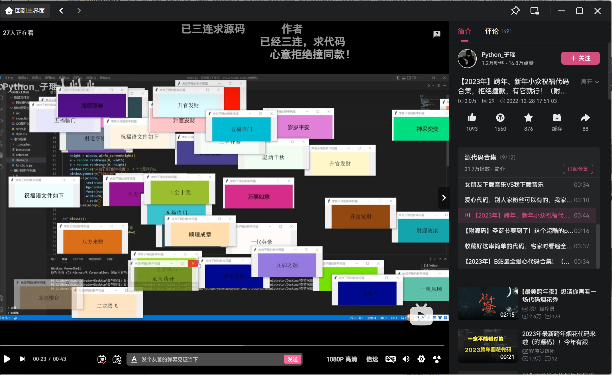

# README

## 项目&源码  
作者：[@ChaseOne1](https://github.com/ChaseOne1)

本项目复刻自bilibili的一位写python的UP主发布的一则有关2023新年祝福的程序源码合集视频里的一个小程序。  
  
源项目大概是使用python写的，具体用了什么库我也不清楚。  
本项目起初是打算用纯Windows API写(所以起初除了源文件是.cpp外其他部分看起来几乎是纯C)，用了大概三两天的时间才基本摸清Windows图形窗口界面的机制。接近完成一半的时候突然想到了之前搜索资料的时候经常出现的“MFC”，于是乎通宵学习了一下，决定主用C++的方式写。  
一切都推倒重来，艰难的一边尝试驯服MFC，一边写项目。也学习到了更多OOP的知识。总的来说重点在于面向对象，而非C++本身。  
**项目逻辑和源码全部原创，没拿到过视频中的程序源码，开局只有一张图**

## 使用

### 运行环境
项目对于MFC的编译方式默认使用了`在共享 DLL 中使用 MFC`，此种方式编译下的程序运行需要有相关dll库才可正常运行。  
发布版也提供了以`在静态库中使用 MFC`方式编译的程序(无-DLL结尾的.exe)，将MFC库包含程序中，可在无有关库的环境下运行。

### 使用方法
双击运行，点击按钮互动即可。